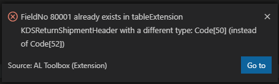

Please visit https://www.altoolbox.com/ for more in depth information and AL Language tips and tricks.

# Change Log
All notable changes to the "al-toolbox" extension will be documented in this file.

## [0.0.3]
- Added another gif to clearly see the utility of regions

## [0.0.9]
- Removed the gif and made it static image
- There was an issue with people that have the C/Side Dev theme installed, the color of the regions would be green instead of blue

## [0.1.0]
- Fixed the Page Subscriber Snippet
- Added Translation Comment to Snippets so that it works with the AL Language Tools Extension
- Added Enum to Int Snippet
- Renamed Subscriptions to Subscribers
- Added CurrPage Lookup Snippet

## [0.1.1]
- Added 3 Snippets
    - rAction
    - rPropertiesAction
    - rRepeat
- Fixed Caption snippets that would have $0 midway instead of at the end

## [0.1.2]
- Added the snippet rDelChr (ALTB)

## [1.0.1]
Added 4 Commands:
- ALTB: Start Project: Create Related Tables | This function will create Tableextensions for Sales Header/Line, Purchase Header/Line and Contact + their Pageextensions.
- ALTB: Create regions for all AL functions and triggers | Running this command will generate Regions around all Functions that don't have regions yet.
- ALTB: Create regions for all AL dataitems and columns | Running this command will generate Regions around all Dataitems and Columns in a report.
- ALTB: Create regions for all AL functions, triggers, dataitems, and columns | Combination of the previous 2.

## [1.1.0]
Added 3 Commands:
- ALTB: Renumber AL Objects | This function will renumber your objects based on the number ranges in the App.json
- ALTB: Change Object Prefix | This function will ask you what the new prefix should be and rename all your objects and the settings.json.
- ALTB: Open Related Tables/Pages | This function will open the related tables/pages for the object you are working on, so you can easily copy paste fields between the related tables of Sales Header for example.
Updated the snippets:
- Replaced variablename with v so that it works better with the variable helper extension
- Added rTableExtension and rPageExtension for those that still want to add in the Original id to the object they are creating (CRS Extension removed it)

## [1.2.0]
Added Command:
- ALTB: Copy fields to related tables | This will copy al fields from the current table to all related tables. If there are conflicts you will get a popup that allows you to navigate to them:

    

## [1.3.0]
Added Command:
- ALTB: init .gitignore

## [1.3.1]
- Fixed Handled parameter in Function Snippets

## [1.3.2]
- Fixed [region folding not working with AL Language version 6.0.x (BC 17)](https://github.com/BartPermentier/al-toolbox/issues/17)

## [1.3.3]
- Added indent based folding. The default indent based folding is overridden if we add folding providers for AL.

## [1.3.4]
- Added Enum Snippets:
  - rGetEnumName
  - rConvertOrdinalToEnum
  - rConvertTextToEnum

## [2.0.0]
- [BugFix] Enable folding for regions without '//'
- Option to disable all folding provided by this extension: ALTB.DisableCustomFolding (Disables folding for "//#region"s)
- Option to use region without '//' for region generation (snippets still use '//'): ALTB.UseAlRegions (Default will be true; set it to false if you still want to use the custom regions provided by this extension)
- Added quick fix for AL0666 -> transforms region without '//' to regions with them.

## [2.0.1]
- Added custom coloring for regions:
  - ALTB.RegionColor: color for region markers (e.g. #region)
  - ALTB.RegionTextColor: color for text after the region markers
- Snippets now use regions without '//' if ALTB.UseAlRegions is true and runtime in app.json >= 6.0
  - Snippets will no longer work with the 'Insert Snippet' command
- Added command ALTB: Add region
  - Adds region arround the currend selection
- [BugFix] Quick fix for AL0666 now only adds '//' for regions (use to do it for all "preprocessor directives")

## [2.0.2]
- Added option to disable snippets: ALTB.DisableSnippets

## [2.0.3]
- Bugfix: AL Toobox prevents folding icons in .al files with many lines #23

## [2.0.5]
- Added command "ALTB: Generate SetLoadFields"
- Show field description on hover

## [2.0.6]
- Added option for checking format of label comments required by the 'AL Language Tools' extension for generating XLIFF files: ALTB.CheckCommentTranslations

## [2.0.8]
- Added commands:
  - ALTB: Renumber fields | Renumbers field numbers in the active editor
  - ALTB: Renumber all fields | Renumbers fields in all tables and table extensions objects (in all workspace folders). 
## [2.0.9]
- Added CodeActions to Add Pragma around warnings.
- Modified the GitIgnore from "*.json", to "launch.json"
- Fixed the CodeunitSubscriber Snippet

## [2.0.10]
- Duplicate fields in ALTB: Generate SetLoadFields: #39
- EnumExtensions are not getting renumbered via "Renumber AL objects" #38

- Fixed the CodeunitSubscriber Snippet

## [2.0.14]
- [Prefix Objects adds too many double quotes](https://github.com/BartPermentier/al-toolbox/issues/44)

## [2.0.15]
- Optimized SetLoadFields functionality
  - Improved record parameter support  #49
  - Exclude SystemId, RecordId and several other system functions #51
  - Only add unique fields (case-insensitive) #50
  - Surround single if ... then or else with begin..end #45
  - Fixed issue on local records of the same type as the current object #48
- Added CodeAction to Add Pragma with TODO Tag #46 & #53
- Added CodeAction to Add Pragma for all error occurences in all documents #42

## [2.0.16]
'Go to Definition' opened in side window when hovering object derived variable #55

## [2.0.17]
Disable field description on hover functionality #55