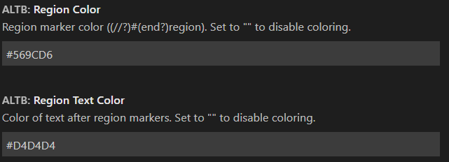

# AL Toolbox for Visual Studio Code

Please visit https://www.altoolbox.com/ for more in depth information and AL Language tips and tricks.

## Features

- Regions Pre AL Language 6.0
- Custom Region Colors
- Snippets
- Actions
- Added Code Cop Warning

## Quick Overview Features
  - [Custom Color of Regions](#custom-color-of-regions)
  - [Quickfixes: Surround with CopyStr](#quickfixes-surround-with-copystr)
  - [Quickfixes: Pragma Warnings](#pragma-warnings)
  - [Action: Create Region](#action-create-region)
  - [Action: Renumber AL Objects](#action-renumber-al-objects)
  - [Action: Change Object Prefix](#action-change-object-prefix)
  - [Action: Create Related Tables](#action-create-related-tables)
  - [Action: Open Related Tables](#action-open-related-tables)
  - [Action: Copy Fields Related Tables](#action-copy-fields-related-tables)
  - [Action: Init Git Ignore](#action-init-git-ignore)
  - [Action: Generate SetLoadFields](#action-generate-setloadfields)
  - [Region Functionality for PRE AL Language 6.0](#region-functionality-for-pre-al-language-60)
  - [Settings](#settings)
  - [Known Issues](#known-issues)

## Custom Color of Regions


You can change the color in UserSettings


## Quickfixes: Surround with CopyStr
Automatic fix for AL(AA0139)


## Pragma Warnings
Every warning/information line will now show a CodeAction to surround with Pragma to ignore it. So that warnings that you can do nothing about can be ignored easily.
- Example:

- Click the Lightbulb:

- Result:


Some variants on the above Pragma CodeAction were added as well:
- Surround ### with Pragma & add TODO tag (with comment)
- Surround ### with Pragma (in all documents)  
## Action: Create Region
- ALTB: Create regions for all AL functions and triggers | Running this command will generate Regions around all Functions that don't have regions yet.

- ALTB: Create regions for all AL dataitems and columns | Running this command will generate Regions around all Dataitems and Columns in a report.

- ALTB: Create regions for all AL functions, triggers, dataitems, and columns | Combination of the previous 2.
## Action: Renumber AL Objects
- ALTB: Renumber AL Objects | This function will renumber your objects based on the number ranges in the App.json
    - Objects will be numbered in ascending order stating with the lowest number in first available range. The ranges are taken from idRange(s) in the app.json file.
    - Extension objects will be added to the 80,000-89,999 range if 80,000 is in the available ranges. If not the same is done as for the other objects.
- ALTB: Renumber fields | Renumbers field numbers in the active editor
- ALTB: Renumber all fields | Renumbers fields in all tables and table extensions objects (in all workspace folders). 
## Action: Change Object Prefix
- ALTB: Change Object Prefix | This function will ask you what the new prefix should be and rename all your objects and the settings.json.
## Action: Create Related Tables
This will create a set of tableextensions that should have the same fields so that there is no issue when standard code issues a TransferFields().


## Action: Open Related Tables
- ALTB: Open Related Tables/Pages | This function will open the related tables/pages for the object you are working on, so you can easily copy paste fields between the related tables of Sales Header for example.
## Action: Copy Fields Related Tables
- ALTB: Copy fields to related tables | This will copy al fields from the current table to all related tables. If there are conflicts you will get a popup that allows you to navigate to them:


## Action: Init Git Ignore
- ALTB: init .gitignore | Creates the following .gitignore in the current workspace folder or appends the missing lines to the existing .gitignore
    ```
    # ALTB
    .alpackages/
    .alcache/
    *.json
    !app.json
    rad.json
    *.app
    ```
## Action: Generate SetLoadFields
ALTB: Generate SetLoadFields | Creates SetLoadFields or adds missing fields to SetLoadFields for a record.
    - Looks for a record at the current mouse position.
    - Only works for local records.
    - For each Get, Find, FindFirst, ... a SetLoadFields function is generated the line before it, unless it already exists.
    - All used fields are added. Assignment is not seen as usage.
## Region Functionality for PRE AL Language 6.0

Either //#Region or the default #Region can be used with this extension. The snippets/actions will adjust automatically according to the runtime you are using.
#Region will now be colored like //#Region; you can change the colors in the User Setup


## Settings

- ALTB.UseOldFileNamingConventions | Boolean: default `true`
    - Use `<ObjectPrefix>(<ExtenedObjectId>-Ext)?<ObjectId>.<ObjectNameExcludingPrefix>.al` instead of `<ObjectNameExcludingPrefix>.<FullTypeName>(Ext)?.al` for file names.

- ALTB.PutCreatedRelatedObjectsInSeparateFolders | Boolean: default `false`
    - If false all objects created with 'ALTB: Start Project: Create Related Tables' are put in there respective object folder. If true each group of related objects is put in a subfolder of that object folder.

- ALTB.AdditionalRelatedObjects | List: default `[]`
    - Adds additional related pages and tables. These are used while navigating and creating related tables.
    Note that this only works for PageExtensions and TableExtensions, not your own Pages and Tables.
    A more indepth explanation can be found in the 'Related Objects' section below.

- ALTB.DisableAPIEntityWarnings | Boolean: default `false`
    - Disables error messages for duplicate EntityName and/or EntitySetName from API pages that have the same APIPublisher, APIGroup, and APIVersion
    
- ALTB.UseAlRegions | Boolean: default `true`
    - Use the standard AL regions instead of the regions previously used by this extension (No longer with '//'). This will only have effect if the runtime in app.json is higher than or equal to 6.0.

- ALTB.DisableCustomFolding | Boolean: default `false`
    - Disable all folding provided by this extension (requires reload).

- ALTB.RegionColor | Color: default `#569CD6` ~ blue
    - Region marker color (`(//)?#(end)?region`). Set to `""` to disable coloring.

- ALTB.RegionTextColor | Color: default `#D4D4D4` ~ white
    - Color of text after region markers. Set to `""` to disable coloring.

- ALTB.DisableHoverProviders | Boolean: default `false`
    - AL Toolbox shows the field description on hover.

- ALTB.CheckCommentTranslations | Boolean: default `false`
    - Checks if label comments match the format required by the 'AL Language Tools' extension for generating XLIFF files

## Known Issues

- ALTB: Renumber AL Objects
  - Extension objects will be added to the 80,000-89,999 range if 80,000 is in the available ranges.
  So if only the range 80,000-80,100 is in the ranges objects will still get ids greater than 80,100.
  - If there exist one or more extension objects of the same type where the last 4 digits of the ids are the same,
  then they will receive the same id. e.g.: extension objects with id 36 and 2,000,036 will both receive 80,036 as id.
  - Extension objects will not be renumbered if they don't have a original object number after there definition and 80,000 is in the available ranges.
  Format example: `pageextension 80021 "EXTCustomerCard" extends "Customer Card" //21`

- ALTB: Change Object Prefix
    - This will only change the prefix of object names and fields.
    So not for actions, events subscribers, parts on pages, keys...

- ALTB: Generate SetLoadFields
    - If there's a Get, Find, ... in a statement over multiple lines, the genered code can be incorrect. e.g:
        ```
        if
            RecVar.Get()
        then
            TestFunction(RecVar.TestField);

        // Will genereate:
        if
            RecVar.SetLoadFields(TestField);
            RecVar.Get()
        then
            TestFunction(RecVar.TestField);
        ```
    
## Folding with Regions Example


## Related Objects

To add additional related objects use the ALTB.AdditionalRelatedObjects setting.

Example format:
```
[
    {  // For adding tableextensions
        "folder": "SalesHeader", // subfolder of src where to place the objects when using "ALTB: Start Project: Create Related Tables"
        "objectType": "tableextension",
        "objects": [ // these tables will be considered related
            { "id": 36, "name": "Sales Header" },
            { "id": 110, "name": "Sales Shipment Header" },
            { "id": 112, "name": "Sales Invoice Header" },
            { "id": 114, "name": "Sales Cr.Memo Header" },
            { "id": 5107, "name": "Sales Header Archive" },
            { "id": 6660, "name": "Return Receipt Header" }
        ]
    },
    ...
    {  // For adding pageextensions
        "table": "Contact",  // source table of pageextension
        "folder": "Contact",   // subfolder of src where to place the objects when using "ALTB: Start Project: Create Related Tables"
        "objectType": "pageextension",
        "objects": [  // pages for the source table
            { "id": 5050, "name": "Contact Card" },
            { "id": 5052, "name": "Contact List" }
        ]
    },
    ...
]
```
The default related objects can be found in [src/constants.js](https://github.com/BartPermentier/al-toolbox/blob/master/src/constants.js) in the AL-toolbox repository (search for RelatedObjects).

## Contributers

- Kasper De Smedt
- Kris Jordaens
- Daan Saveyn
- Johannes Wikman (jwikman)

## Special Thanks
Special thanks to ESC BV for investing in this tool! https://esc.be/